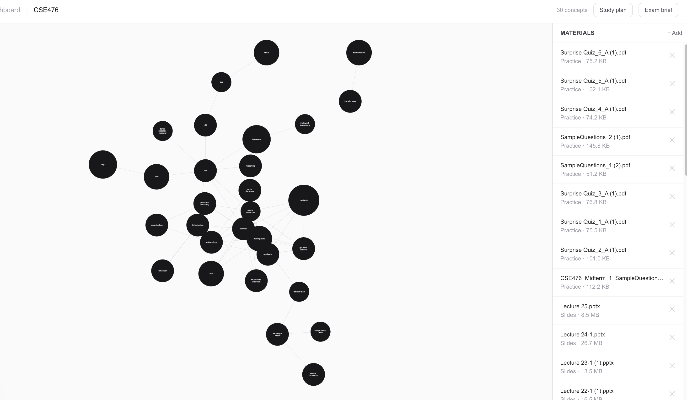
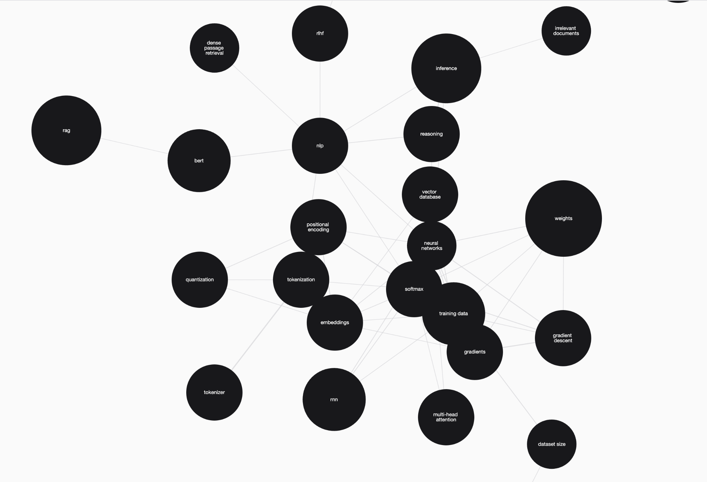

# Oris

Oris turns your course slides, past exams, and homework into a visual knowledge graph — showing exactly which concepts your professor tests most, with practice questions and cited sources for each one.

<table>
  <tr>
    <td></td>
    <td></td>
  </tr>
</table>

**Live demo:** https://oris-mu.vercel.app/login

---

## Tech stack

| Layer | Technology |
|---|---|
| Frontend | Next.js 16 (App Router), Tailwind CSS, deployed on Vercel |
| Backend | Python FastAPI, deployed on Railway |
| Database | Supabase Postgres + pgvector |
| Auth | Supabase Auth (Google OAuth) |
| Graph visualization | cytoscape.js via react-cytoscapejs |
| NLP | spaCy `en_core_web_sm` |
| Embeddings | sentence-transformers `all-MiniLM-L6-v2` (local, no API cost) |
| Question generation | Groq API (`llama-3.1-8b-instant`) |
| File parsing | python-pptx, pdfplumber |

---

## How it works

### NLP concept extraction

Rather than asking an LLM to summarize course material (which hallucinates), Oris uses spaCy to extract noun chunks and named entities directly from practice material text — past exams, homework, and quizzes. Each candidate term goes through a multi-stage quality filter: leading articles are stripped, generic single words (like "result", "type", "model") are blocklisted, multi-word exam-question phrases (like "key difference" or "which statement") are rejected, and answer-choice line prefixes (`a.`, `b)`, `Q1.`) are stripped before spaCy ever sees the text. Terms are then scored by how many distinct practice chunks mention them, normalized to a 0–1 exam weight. This gives a frequency-grounded signal of what a professor actually tests — without any LLM involvement in the extraction step.

### pgvector similarity search for concept–slide linking

After extraction, each concept needs to know which slide chunks are most relevant to it — not just the practice chunks that mentioned it, but the lecture slides that explain it. Oris encodes concept names as 384-dimensional vectors using `all-MiniLM-L6-v2` and runs a cosine similarity search against all slide chunk embeddings stored in Supabase's pgvector column (`embedding <=> query_vector`). The top 5 most semantically similar slides per concept are linked via the `concept_chunks` table. This means the concept card's "Sources" section shows the actual lecture slides that cover the topic, and the Groq question generator receives grounded slide context rather than generating from nothing.

---

## Local setup

### Prerequisites
- Node.js 18+
- Python 3.11
- A [Supabase](https://supabase.com) project with pgvector enabled
- A [Groq](https://console.groq.com) API key (free tier)
- Google OAuth credentials (for login)

### 1. Clone the repo

```bash
git clone https://github.com/your-username/oris.git
cd oris
```

### 2. Backend

```bash
cd backend
python3.11 -m venv venv
source venv/bin/activate
pip install -r requirements.txt
python -m spacy download en_core_web_sm
```

Create `backend/.env`:

```
SUPABASE_URL=your_supabase_project_url
SUPABASE_SERVICE_ROLE_KEY=your_supabase_service_role_key
GROQ_API_KEY=your_groq_api_key
```

Run the database schema in your Supabase SQL editor (see `backend/db/schema.sql`), then also run:

```sql
CREATE OR REPLACE FUNCTION match_slide_chunks(
    p_course_id UUID,
    p_embedding vector(384),
    p_limit INT DEFAULT 5
)
RETURNS TABLE(id UUID)
LANGUAGE sql STABLE
AS $$
    SELECT id FROM chunks
    WHERE course_id = p_course_id
      AND source_type = 'slide'
      AND embedding IS NOT NULL
    ORDER BY embedding <=> p_embedding
    LIMIT p_limit;
$$;
```

Start the server:

```bash
uvicorn main:app --reload
```

### 3. Frontend

```bash
cd frontend/oris-frontend
npm install
```

Create `frontend/oris-frontend/.env.local`:

```
NEXT_PUBLIC_SUPABASE_URL=your_supabase_project_url
NEXT_PUBLIC_SUPABASE_ANON_KEY=your_supabase_anon_key
NEXT_PUBLIC_API_URL=http://localhost:8000
```

Start the dev server:

```bash
npm run dev
```

Open [http://localhost:3000](http://localhost:3000).
